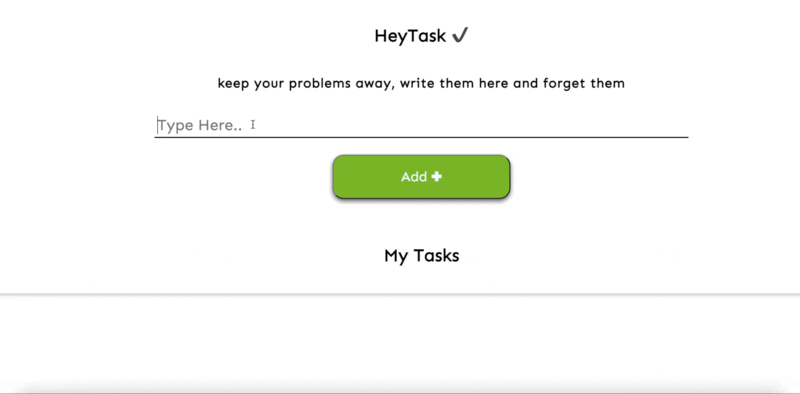

# HeyTask

A minimalist to-do list app — clean, lightweight, but super effective.

Built with vanilla JavaScript, HTML, and CSS. No frameworks, no clutter — just tasks.

✅ Features
	•	Add & remove tasks easily
	•	Super lightweight and fast
	•	Minimal UI for max focus
	•	Works perfectly on desktop

💻 Live Demo

---
## 👉 [Try it here](https://mikixit.github.io/HeyTask/)

🔧 Tech Stack
	•	JavaScript (Vanilla)
	•	HTML5
	•	CSS3

📦 About

This is a tiny project I made to keep my tasks in check without distractions.
Designed and developed by MikixIT.
